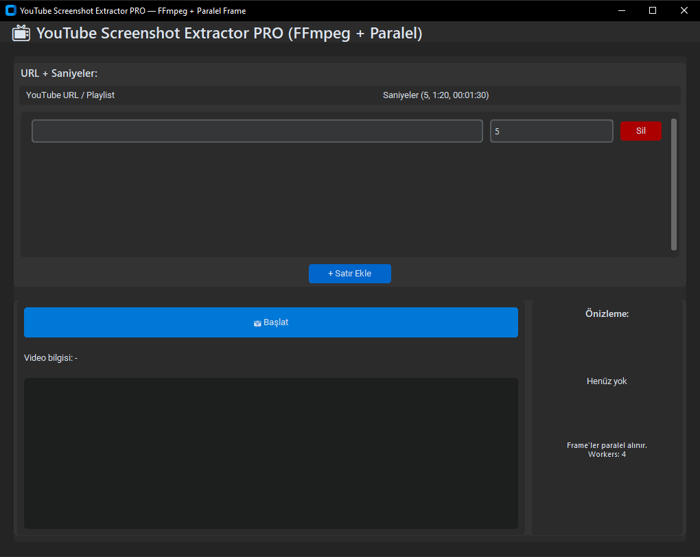

# 📺 YT Screenshot Extractor PRO  
**YouTube videolarından ve playlistlerden otomatik 4K ekran görüntüsü alma aracı (Metro UI - Python GUI)**  



---

## 🌟 Özellikler

### 🎥 Video & Playlist İşleme
- ✔ YouTube video linklerinden frame alma  
- ✔ Shorts URL destekler  
- ✔ Playlist URL veya sadece playlist **ID** desteği  
- ✔ Videonun çözünürlüğü GUI üzerinde gösterilir  
- ✔ Videonun süresi (mm:ss / hh:mm:ss) gösterilir  
- ✔ Çoklu URL işleme  
- ✔ YouTube → Video ID → Tüm kalite bilgilerini otomatik algılar  

---

### 🖼 Frame & Thumbnail Çıkartma
- ✔ Belirli saniyelerden **PNG** formatında frame çıkarır  
- ✔ Thumbnail (kapak fotoğrafı) indirir  
- ✔ Dosya isimlerini video başlığına göre otomatik üretir *(slugify)*  
- ✔ Her video için ayrı klasör oluşturur  
- ✔ Son alınan frame sağ tarafta küçük önizleme panelinde gösterilir  

📁 **Örnek klasör yapısı:**

```
cikti/
 ├─ Video_Basligi/
 │    ├─ Video_Basligi_t0s.png
 │    ├─ Video_Basligi_t3s.png
 │    ├─ Video_Basligi_thumbnail.png
 ├─ Başka_Bir_Video/
 │    └─ ...
```

---

### 📂 Playlist Özellikleri
- ✔ Playlist URL veya playlist **ID** ile tüm videoları otomatik işler  
- ✔ Toplam video sayısını gösterir  
- ✔ Playlist ilerleme barı → “X / Toplam (%Y)”  
- ✔ Her video işlendikçe log paneline yazılır  

---

### 🧊 Donmayan Arayüz
- ✔ Ağır işlemler **thread** içinde yürütülür  
- ✔ GUI donmaz  
- ✔ İşlem sırasında “⏳ Çalışıyor…” buton durumu  
- ✔ İşlem bitince otomatik olarak normale döner  

---

### 🎨 Metro UI Arayüz
Modern Windows 11 tarzı arayüz:

- ✔ CustomTkinter ile premium modern UI  
- ✔ Geniş URL alanı  
- ✔ Playlist progress bar  
- ✔ Video bilgi paneli  
- ✔ Son frame küçük önizleme kutusu  
- ✔ Log ekranı (Consolas font)  

---

## 🛠 Kullanılan Teknolojiler

- 🐍 **Python 3.x**
- 🎨 **CustomTkinter**  
- 🎬 **OpenCV**  
- 📦 **yt-dlp**  
- 🖼 **Pillow**  
- 🧵 **Threading**  

---

## 📦 Kurulum

```bash
git clone https://github.com/ebubekirbastama/yt-screenshot-extractor.git
cd yt-screenshot-extractor
pip install -r requirements.txt
```

### requirements.txt içeriği:

```
yt-dlp
customtkinter
opencv-python
pillow
```

---

## ▶️ Çalıştırma

```bash
python youtube_screenshot_extractor_pro.py
```

---

## 📘 Kullanım

### 🔹 1. URL / Playlist / Playlist ID Girişi  
Video URL:
```
https://www.youtube.com/watch?v=Example123
```

Shorts:
```
https://www.youtube.com/shorts/O8wDnTl5e6U
```

Playlist URL:
```
https://www.youtube.com/playlist?list=PLxxxxxx
```

Sadece playlist ID:
```
PLX4Y6y8Hmb9MCB0YsiYJvLjiIzcej2tew
```

---

### 🔹 2. Frame Saniyelerini Belirleme
Örnek:
```
0,1,3,5
```

---

### 🔹 3. Başlat Butonu  
- GUI donmaz  
- Playlist videoları sırayla işlenir  
- Log paneli güncellenir  
- Frame + thumbnail kayıt edilir  
- Son frame önizlemede gösterilir  

---

## 📄 Log Paneli
- Hangi video işleniyor  
- Video başlığı  
- Çözünürlük ve süre  
- Alınan frame listesi  
- Thumbnail durumu  
- Playlist ilerleme miktarı  

---

## ⚙️ Gelecekte Eklenebilir Özellikler
- ⏱ Her saniyede 1 frame çıkarma modu  
- 🎨 Tema değiştirme  
- 📁 Çıktı klasörü seçme  
- 🔊 Sesli bildirim  
- 🧪 “İlk X videoyu işle” modu  

---

## 👨‍💻 Geliştirici  
**Ebubekir Bastama**  
GitHub: https://github.com/ebubekirbastama  

---

## 📜 Lisans
MIT lisans.
